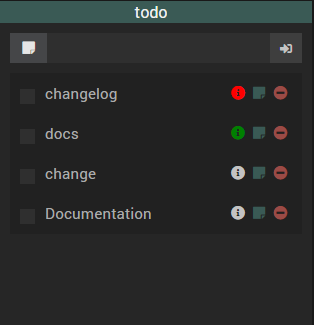
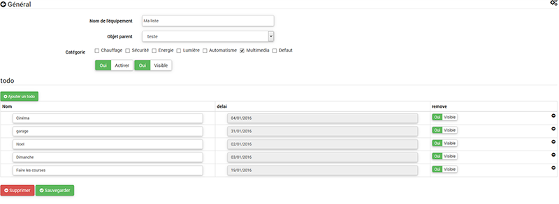
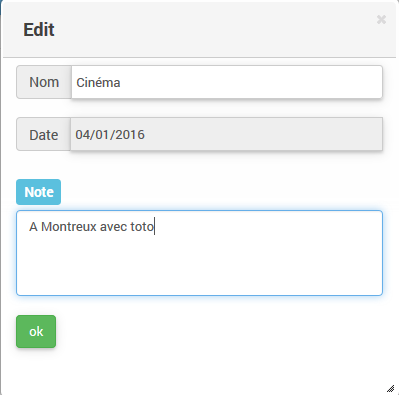

Description 
===

Ce plugin vous permet de Créer des listes de tâches, d'actions , de courses. Libre à vous de savoir ce que vous allez en faire

Installation
===

Comme n'importe quel plugin.

Configuration
===

Rien de particulier.Il faut télécharger le plugin sur le market et l'activer. 

Après l'avoir activer , lancer les dépendances et aller dans Plugins/Organisation/Todo List. Cliquer sur le + pour créer un nouvel équipement.

Utilisation
===

Les éléments
---

Vous pouvez les créer à partir de l'équipement en cliquand sur l'onglet "Tâches"

Les Widgets
---

**Le dashboard (Jeedom v3)**

**Le dashboard (Jeedom v4)**

1. Vous pouvez ajouter un éléments via l'input et cliquer sur add ensuite. S'il existe il sera ajouté sinon il sera créé . Fonction Autocomplete 
2. Le bouton refresh vide la liste (Mais n'efface pas le éléments)
3. Un check efface l'élément de la liste
4. Un click sur le remove efface l'élément de l'équipement (définitif)
5. Un click sur le crayon ouvre une modale pour permettre de configurer un peu plus l'élément.
6. L'icône info permet de savoir si la tâche est dans les délais 

**Vue mobile**

> **IMPORTANT**
>
> La taille sur la version mobile est définie à partir de la taille sur le dashboard.
>

**Possibilité d'activer le Panel mobile et Desktop**

Utilisation
===

**Possibilité d'ajouter une date pour le todo et ensuite check lors de l'affichage qui vérifie si date passée ( icône rouge-> dépassée , icône verte-> ok , agenda-> aujourd'hui)**

Possible d'ajouter une date via le menu du plugin

**Ou via le dashboard en cliquant sur l'icône edit**

Les commandes
====

**Possibilité de créer une todo via un scénario :**

**Ou de récupérer la liste de toutes les tâches :**

**Ou de recréer toutes les tâches via la commande refresh**

Remarques
===

Caractères spèciaux
---

* Le "_(underscore)" est à proscrire dans le nom d'un élément d'une liste 

