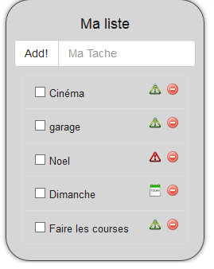

Description 
===========

Ce plugin vous permet de Créer des lists de tâches, d'actions , de courses. Libre à vous de savoir ce que vous allez en faire

Installation
=============

Comme n'importe quel plugin.

Vues diverses
===========

**Le dashboard**

**Vue mobile**

**Voici la vue mobile dans plugins/Todo List**

Utilisation
========

**Possibilité d'ajouter une date pour le todo et ensuite check lors de l'affichage qui vérifie si date passée ( icône rouge-> dépassée , icône verte-> ok , agenda-> aujourd'hui)**

Possible d'ajouter une date via le menu du plugin

**Ou via le dashboard en cliquant sur l'icône edit**

Les commandes
====

**Possibilité de créer une todo via un scénario :**

**Ou de récupérer la liste de toutes les tâches: **

