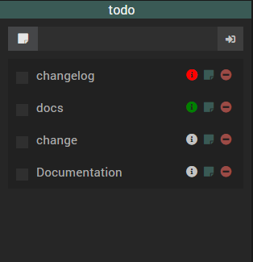

## Description

Ce plugin permet de créer et gérer des listes de tâches (todo), d’actions ou de courses.
Libre à vous de choisir comment les exploiter (widgets, scénarios, etc.).

## Installation

Comme n’importe quel plugin Jeedom :

1. Installer depuis le Market
2. Activer le plugin
3. Lancer les dépendances si nécessaire

## Configuration

Aucune configuration particulière.

Après activation :

1. Aller dans **Plugins → Organisation → Todo List**
2. Cliquer sur **+** pour créer un nouvel équipement
3. Sauvegarder

## Utilisation

### Les éléments (tâches)

Vous pouvez créer des éléments depuis l’équipement en cliquant sur l’onglet **“Tâches”**.

### Les widgets

#### Dashboard (Jeedom v3)

#### Dashboard (Jeedom v4)

Fonctionnement :

1. Ajouter un élément via l’input puis cliquer sur **Add**
   - S’il existe, il est ajouté
   - Sinon, il est créé (autocomplete)
2. Le bouton **Refresh** vide la liste (sans supprimer les éléments)
3. Cocher une tâche la retire de la liste
4. Cliquer sur **Remove** supprime l’élément de l’équipement (définitif)
5. Cliquer sur le **crayon** ouvre une modale de configuration de l’élément
6. L’icône **info** indique si la tâche est dans les délais

#### Vue mobile

> <strong>IMPORTANT</strong>
> La taille sur la version mobile est définie à partir de la taille sur le dashboard.

### Dates / statut (délais)

Vous pouvez ajouter une date à une tâche. Lors de l’affichage, une icône indique l’état :

- **Rouge** : dépassée
- **Vert** : OK
- **Agenda** : aujourd’hui

Ajout d’une date via le menu du plugin :

Ou via le dashboard en cliquant sur l’icône **edit** :

## Commandes

### Créer une tâche via un scénario

### Récupérer la liste de toutes les tâches

### Recréer toutes les tâches via la commande Refresh

La commande **Refresh** reconstruit la liste sur la base des éléments déjà créés.

## Remarques

### Caractères spéciaux

- Le caractère `_` (underscore) est à proscrire dans le nom d’un élément.
